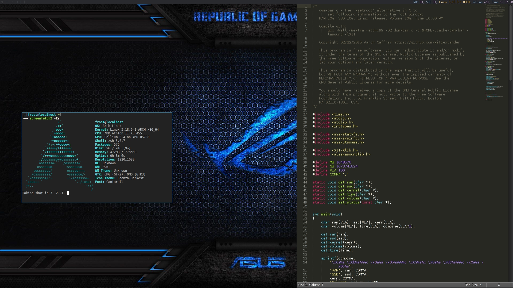

The code doesn't age, neither it has expiration date.

## Table of Contents

- [Installation for dwm](#installation-for-dwm)
- [Installation for py3status](#installation-for-py3status)
- [Installation for xmonad/other WM](#installation-for-xmonad-or-other-wm)
- [Installation in FreeBSD](#installation-in-freebsd)
- [Installation in OpenBSD](#installation-in-openbsd)
- [Installation for anything else](#installation-for-anything-else)
- [Configure Options](#gnu-build-system-configure-options)
- [Program Options](#program-options)
- [Supported distros](#supported-distros)
- [Using configuration file](#using-configuration-file)
- [Linux Requirements](#linux-mandatory-requirements)
- [BSD Requirements](#bsd-mandatory-requirements)
- [Opt-in Requirements](#opt-in-requirements)
- [WM Requirements](#wm-specific-requirements)
- [OCAML lang](#ocaml-lang)
- [Rust lang](#rust-lang)
- [Go lang](#go-lang)
- [Assembly](#assembly)
- [VoidLinux](#voidlinux)
- [TinyCoreLinux](#tinycorelinux)
- [Wish list](#wish-list)
- [Pre-History](#pre-history)

---

dwm


xmonad


ncurses


py3status


Gather some system information and show it in this statusbar program, not tied to any Window Manager, terminal multiplexer, etc.

Please note that the program won't detect fans connected via molex connetor(s) or external fan controller. Also I have not tested it with fan splitter(s) either.

The program is smart enough to detect whether some of your fan(s) blades are spinning, or the particular fan have been removed. Hold down some of your fan blades and you'll see that the program won't include this fan and it's RPM, release the blades and you'll see the fan and it's RPM in the statusbar. Try simulating real fan hardware failure by holding down all system fan blades and watch what the program will show you, just try not to slice your cheesy fingers open in the process.

You can extend pinky-bar with your own crafted perl/python/ruby/lua/R/assembly/lisp/ocaml/rust/go/c++/slang/tcl script.

If you compile your kernel from source code make sure to include your cpu and motherboard sensors as **modules** and not inlined.

**Just an example if you use BSD - acpi/aibs, coretemp/amdtemp.**


---

## Installation for dwm

```bash
perl set.pl "distro"
autoreconf --install --force

./configure --prefix=$HOME/.cache --with-dwm --with-colors
make
make install
```

Copy the code from extra/scripts/dwm.sh or `exec` it from **xinitrc** or the script used to start dwm.

---

## Installation for py3status

```bash
perl set.pl "distro"
autoreconf --install --force

./configure --prefix=$HOME/.cache --with-py3status --with-colors
make
make install
```

---

## Installation for xmonad (or other WM)

```bash
# Copy the xbm icons
mkdir -p --mode=700 $HOME/.xmonad/icons
cp -r extra/xbm_icons/*.xbm $HOME/.xmonad/icons

perl set.pl "distro"
autoreconf --install --force

# here you can specify --with-awesomewm or --with-xmobar
./configure --prefix=$HOME/.cache --with-colors icons=$HOME/.xmonad/icons

# compile 'n install
make
make install
```

Copy the code from extra/scripts/xmonad.sh or `exec` it from **xinitrc** or the script used to start xmonad.

---

## Installation in FreeBSD

FreeBSD has no other way than using the module specific convention to query sysctl and obtain data from the sensors. Maintaining a list with all the possible module names and performing expensive sysctl calls in a loop to determine that X module is loaded into your system is no-go. Be prepared to spend a minute or two to find out some system information.

Determine the motherboard sensor module name.

```bash
sysctl -a|grep 'aibs'

dev.aibs.0.volt.0: 1356 850 1600
dev.aibs.0.volt.1: 3344 2970 3630
dev.aibs.0.volt.2: 5040 4500 5500
dev.aibs.0.volt.3: 12278 10200 13800
dev.aibs.0.temp.0: 39.0C 60.0C 95.0C
dev.aibs.0.temp.1: 38.0C 45.0C 75.0C
dev.aibs.0.fan.0: 1053 600 7200
dev.aibs.0.fan.1: 1053 600 7200
```

Copy only 'dev.MODULE.NUMBER' (if there is any number at all) and paste it into the **mobo\_sensor** option below.

Do the same for your cpu temperature, copy and paste the variable as is. **dev.cpu.0.temperature** below is provied as example.

```bash
perl set.pl "freebsd"
autoreconf --install --force

./configure --prefix=$HOME/.cache --without-alsa --with-oss mobo_sensor='dev.aibs.0' cpu_sensor='dev.cpu.0.temperature'
make
make install
```

Send a request to the FreeBSD mailing list and request the OpenBSD sensors API to be ported.

---

## Installation in OpenBSD

Before proceeding, you'll have to:

```bash
# To detect the newer compiler that you are
# about to install
sed -i 's/#AC_PROG_CC(/AC_PROG_CC(/g' configure.ac

ls /usr/local/bin/automake-*
ls /usr/local/bin/autoconf-*

# Then replace the numbers below
export AUTOCONF_VERSION=2.69
export AUTOMAKE_VERSION=1.15

# Your call, gcc or llvm ?
pkg_add gcc

# after that:
perl set.pl "openbsd"
autoreconf --install --force

./configure --prefix=$HOME/.cache --without-alsa --with-oss
make
make install
```

---

## Installation for anything else

pinky-bar is no longer tied to Window Managers only. With the addition of "without colors", the output can be shown in any program, just bear in mind that the more options you've supplied the more system information will be shown. 

The tmux status bar in action:


The installation steps:

```bash
perl set.pl "distro"
autoreconf --install --force

./configure --prefix=$HOME/.cache --without-colors
make
make install
```

By choosing this 3rd installation method it is up to you where, how to start and use the system information that's produced by pinky-bar.

---


## GNU Build System (configure) options

Before the source code is passed to the compiler, you can enable/disable the following **configure** options 
that will increase/reduce the number of dependencies required to compile the program.

It's up to you to decide which features suit you best.

| To include     | Not to include      | Descrtiption                                                                               |
|----------------|---------------------|--------------------------------------------------------------------------------------------|
| --with-dwm     | --without-dwm       | Enable it if you are using dwm.                                                            |
| --with-alsa    | --without-alsa      | To get the sound volume level.                                                             |
| --with-oss     | --without-oss       | To get the sound volume level in \*BSD.                                                    |
| --with-net     | --without-net       | Enable the internet related options.                                                       |
| --with-libnl   | --without-libnl     | Enable the wifi related options regarding chipsets supporting the cfg80211/mac80211 modules (linux only).  |
| --with-pci     | --without-pci       | To get the NIC vendor and model in linux                                                   |
| --with-dvd     | --without-dvd       | To get the cdrom/dvdrom vendor and model                                                   |
| --with-sensors | --without-sensors   | Alternative way to get data from the sensors (linux only)                                  |
| --with-apm     | --without-apm       | APM power and resource management for laptops (FreeBSD only)                               |
| --with-ncurses | --without-ncurses   | Output the data to the terminal using the ncurses library, can be colorized                |
| --with-perl    | --without-perl      | Extend pinkybar with your own crafted scripts written in perl                              |
| --with-lua     | --without-lua       | Extend pinkybar with your own crafted scripts written in lua                               |
| --with-ruby    | --without-ruby      | Extend pinkybar with your own crafted scripts written in ruby                              |
| --with-python2 | --without-python2   | Extend pinkybar with your own crafted scripts written in python2                           |
| --with-python3 | --without-python3   | Extend pinkybar with your own crafted scripts written in python3                           |
| --with-r       | --without-r         | Extend pinkybar with your own crafted scripts written in R                                 |
| --with-assembly| --without-assembly  | Extend pinkybar with assembly                                                              |
| --with-lisp    | --without-lisp      | Extend pinkybar with your own crafted scripts written in lisp                              |
| --with-ocaml   | --without-ocaml     | Extend pinkybar with your own crafted scripts written in ocaml                             |
| --with-rust    | --without-rust      | Extend pinkybar with your own crafted scripts written in rust                              |
| --with-go      | --without-go        | Extend pinkybar with your own crafted scripts written in go                                |
| --with-cpp     | --without-cpp       | Extend pinkybar with c++ program                                                           |
| --with-slang   | --without-slang     | Extend pinkybar with slang program                                                         |
| --with-tcl     | --without-tcl       | Extend pinkybar with tcl program                                                           |
| --with-weather | --without-weather   | The temperature outside  (some details must be provided)                                   |
| api\_key='123458976'               | | API key obtained after registering yourself in the weather website, must be combined **--with-weather**  |
| --with-smartemp | --without-smartemp   | Read the drive temperature from S.M.A.R.T cross-platform available                       |
| --with-drivetemp | --without-drivetemp   | Read the drive temperature from S.M.A.R.T (linux only) uses curl                       |
| --with-drivetemp-light | --without-drivetemp-light   | Read the drive temperature from S.M.A.R.T (linux only) light version       |
| drive\_port='1234'  |                | Different TCP port to listen to for the drive temperature, default one is 7634, must be combined **--with-drivetemp** or **--with-drivetemp-light**   |
| --with-colors  | --without-colors    | Colorize the output data. When using non-dwm, non-ncurses, non-py3status, you must combine this option with **icons=PATH**. |
| icons=/tmp     |                     | xbm icons that can be used by dzen2 for example. Discarded when **--with-dwm** is used     |
| --with-mpd     | --without-mpd       | To see the currently played song name (if any).                                            |
| --with-keyboard | --without-keyboard | Query xorg and show the currently used keyboard layout                                     |
| --with-mouse   | --without-mouse     | Query xorg and get the mouse speed in percentage                                           |
| --with-numcapslock | --without-numcapslock | Query xorg to get the current state of numlock, capslock and scroll lock             |
| --with-ip      | --without-ip        | Return your external ip address (ipv4).                                                    |
| --with-gmail    | --without-gmail      | Query gmail and show all unread emails, must be combined with the variables **gmail_account** and **gmail_password**  |
| gmail\_account=foo  |                | Your gmail account goes here, must be combined **--with-mail**                             |
| gmail\_password=bar |                | Your gmail account password goes here, must be combined **--with-mail**                    |
| --with-github  | --without-github    | Query GitHub and number all unread notifications                                           |
| github\_token=foo  |                 | [Generate token for specific scope](https://github.com/settings/tokens/new?scopes=notifications&description=pinky-bar), must be combined **--with-github**  |
| --with-reddit  | --without-reddit    | Query reddit and number all unread notifications                                           |
| reddit\_feed=foo  |                  | [copy the JSON link and paste it to this variable](https://www.reddit.com/prefs/feeds/), must be combined **--with-reddit**  |
| --with-pingtime | --without-pingtime | Perform a GET request and measure the round trip time                                      |
| --with-sqlite  | --without-sqlite    | Connect to sqlite db and perform SELECT operation                                          |
| sqlite\_db=foo |                     | The place where your db is located                                                         |
| --with-py3status | --without-py3status | Format the output data for py3status, can be colorized via **--with-colors**             |
| --with-awesomewm | --without-awesomewm | Format the output data for awesomewm, can be colorized via **--with-colors**             |
| --with-xmobar  | --without-xmobar    | Format the output data for xmobar, can be colorized via **--with-colors**                  |
| --prefix=/tmp  |                     | The directory where the program will be installed                                          |
| mobo\_sensor='dev.aibs.0'  |         | FreeBSD motherboard sensor module name to use in the sysctl calls. Read the FreeBSD installation below  |
| cpu\_sensor='dev.cpu.0.temperature' |  | FreeBSD cpu temperature module name to use in the sysctl calls . Read the FreeBSD installation below  |

By default, if **no** options are passed, the program will be compiled with:

```bash
# --with-pci is discarded in *BSD
--with-net --with-pci --with-alsa
```

Affects **--with-gmail**. If you get error 403 unauthorized, then allow [less secure apps](https://myaccount.google.com/lesssecureapps) to access your account.

Affects only FreeBSD users with laptops, **--without-apm** will compile the program with acpi support to obtain the current battery life.

**--without-mpd** will compile the program with cmus support, the options syntax stays as is.

The pci and sensors configure options will be discarded in \*BSD.

Affects only linux users with wifi/wireless chipsets, run `lsmod|grep 802` and see whether your chipset uses cfg80211/mac80211. If that's so you can rely on libnl and enable **--with-libnl** configure options, otherwise your chipset probably still uses we/wext, so type **--without-libnl**.

Affects only linux users, **--with-drivetemp** pretty much locks you down to hddtemp. You can adjust **extra/scripts/drive-temperature.sh** and compile the program **--with-smartemp**, so you can switch between hddtemp and smartmontools at any time without the need recompile pinkybar with different options. **--with-smartemp** only cares for the existance of /tmp/pinkytemp file.

**--with-weather** is using [this url](http://openweathermap.org/current), register yourself there, create a new [API key](https://home.openweathermap.org/api\_keys).

Don't just rush to register yourself, read carefully what the "Free" account limits are and take in account how often the program should call their api service. I'm not responsible if you exceeded the limits, you've been warned.

```bash
# Make sure it's working first
# curl 'http://api.openweathermap.org/data/2.5/weather?q=London,uk&units=metric&APPID=28459ae16e4b3a7e5628ff21f4907b6f'

# what to pass to configure
--with-weather api_key='28459ae16e4b3a7e5628ff21f4907b6f'
```

---

## Program options

The order of supplied options will dictate how, where and what system information to be shown.

| short option | long option | Descrtiption                                                       |
|--------------|-------------|--------------------------------------------------------------------|
| -M           | --mpd       | The song filename                                                  |
| -W           | --mpdtrack  | The song track name  (not available in cmus)                       |
| -x           | --mpdartist | The song artist(s) name(s)                                         |
| -X           | --mpdtitle  | The song title                                                     |
| -y           | --mpdalbum  | The song album name                                                |
| -Y           | --mpddate   | The song date                                                      |
| -c           | --cpu       | The current cpu load (summed up all cores/threads)                 |
| -L           | --coresload | Show the load regarding each individual cpu core/thread            |
| -T           | --cputemp   | The current cpu temperature                                        |
| -C           | --cpuspeed  | Show your maximum cpu clock speed in MHz, regardless of the used governor. Uses assembly. |
| -I           | --cpuinfo   | Detect your CPU vendor, stepping, family, clflush, l1/l2 cache and line size, physical cores, physical and virtual bits. Uses assembly. |
| -r           | --ramperc   | The used ram in percentage                                         |
| -J           | --ramtotal  | The total ram                                                      |
| -K           | --ramfree   | The free ram                                                       |
| -l           | --ramshared | The shared ram                                                     |
| -o           | --rambuffer | The buffer ram (not available in OpenBSD)                          |
| -s           | --driveperc | The used drive storage in percentage                               |
| -n           | --drivetotal| The total drive storage                                            |
| -N           | --drivefree | The free drive storage                                             |
| -O           | --driveavail| The available drive storage (total - used)                         |
|              | --drivetemp | Read the drive temperature from S.M.A.R.T                          |
| -g           | --battery   | The remaining battery charge                                       |
| -z           | --dvdstr    | The vendor and model name of your cdrom/dvdrom                     |
| -S           | --statio    | Read and written MBs to the drive so far [argument - sda]          |
| -p           | --packages  | The number of installed packages                                   |
| -P           | --kernsys   | The kernel name                                                    |
|              | --kernode   | The network node hostname                                          |
| -Q           | --kernrel   | The kernel release                                                 |
| -R           | --kernver   | The kernel version                                                 |
| -u           | --kernarch  | The machine architecture                                           |
| -k           | --kernel    | Combined kernel name and version                                   |
|              | --keyboard  | Query xorg and show the currently used keyboard layout             |
|              | --mouse     | Query xorg and get the mouse speed in percentage                   |
|              | --numlock   | Query xorg to get the current state of numlock                     |
|              | --capslock  | Query xorg to get the current state of capslock                    |
|              | --scrolllock | Query xorg to get the current state of scroll lock                |
|              | --gmail     | Query gmail and show all unread emails                             |
|              | --github    | Query GitHub and number all unread notifications                   |
|              | --reddit    | Query reddit and number all unread notifications                   |
|              | --password  | Generate random password [argument number of iterations to perform] |
|              | --shell     | Static string that's displayed to you, could be a TODO or notes or use the shell itself and execute some command that returns something, eg: --shell=$(tail --lines 1 /var/log/Xorg.0.log), [argument - static string] |
|              | --perl      | Extend pinkybar with your scripts written in perl, learn more from the Opt-in section.     |
|              | --python    | Extend pinkybar with your scripts written in python, learn more from the Opt-in section.     |
|              | --ruby      | Extend pinkybar with your scripts written in ruby, learn more from the Opt-in section.     |
|              | --lua       | Extend pinkybar with your scripts written in lua, learn more from the Opt-in section.     |
|              | --R         | Extend pinkybar with your scripts written in R, learn more from the Opt-in section.     |
|              | --asm       | Extend pinkybar with assembly, learn more from the Opt-in section. |
|              | --lisp      | Extend pinkybar with your scripts written in lisp, learn more from the Opt-in section.     |
|              | --ocaml     | Extend pinkybar with your scripts written in ocaml, learn more from the Opt-in section.     |
|              | --rust      | Extend pinkybar with your scripts written in rust, learn more from the Opt-in section.     |
|              | --go        | Extend pinkybar with your scripts written in go, learn more from the Opt-in section.     |
|              | --cpp       | Extend pinkybar with your cpp, learn more from the Opt-in section.  |
|              | --slang     | Extend pinkybar with your slang, learn more from the Opt-in section.  |
|              | --tcl       | Extend pinkybar with your tcl, learn more from the Opt-in section. |
|              | --sqlite    | Connect to sqlite db and perform SELECT operation, [argument e.g: "SELECT * from COMPANY where ID=1"]  |
| -q           | --weather   | Show the temperature outside [argument - London,uk]                |
| -U           | --uptime    | The system uptime                                                  |
| -w           | --load\_1min | The system average load for past 1 minutes                        |
|              | --load\_5min | The system average load for past 5 minutes                        |
|              | --load\_15min | The system average load for past 15 minutes                      |
| -v           | --voltage   | The system voltage                                                 |
| -f           | --fans      | All system fans and their speed in RPM                             |
| -m           | --mobo      | Show the motherboard name and vendor                               |
| -d           | --mobotemp  | The motherboard temperature                                        |
| -V           | --volume    | The sound volume level                                             |
| -t           | --time      | The current time                                                   |
|              | --ip        | Return your external ip address (ipv4).                            |
| -a           | --ipaddr    | The local ip address [argument - eth0]                             |
| -b           | --bandwidth | The consumed internet bandwidth so far [argument - eth0]           |
| -i           | --iface     | The current download and upload speed [argument - eth0]            |
| -A           | --ipmac     | The NIC mac address [argument - eth0]                              |
| -B           | --ipmask    | The NIC subnet mask [argument - eth0]                              |
| -D           | --ipcast    | The NIC broadcast address [argument - eth0]                        |
| -E           | --iplookup  | Mini website IP lookup [website argument - google.com]             |
|              | --pingtime  | Perform a GET request and measure the round trip time. [website argument https://wordpress.com]                 |

Be aware of the options that mention **Uses assembly** are tested only on AMD and Intel CPUs (starting from pentium 4 onwards).

The following options are available only in Linux:

| short option | long option | Descrtiption                                                       |
|--------------|-------------|--------------------------------------------------------------------|
|              | --ramused   | The used ram in MB                                                 |
| -F           | --drivemodel| The vendor name of your drive [argument - sda]                     |
| -G           | --nicinfo   | The NIC vendor and model [argument - eth0]                         |
|              | --nicdrv    | The NIC driver [argument - eth0]                                   |
| -H           | --nicver    | The NIC version [argument - eth0]                                  |
| -e           | --iplink    | The NIC link speed (useful for wireless/wifi) [argument - eth0]    |
| -j           | --nicfw     | The NIC firmware [argument - eth0]                                 |
| -h           | --wifiname  | The name of currently connected wifi/wireless network [argument - wlan0]  |

The following options are available only in archlinux, debian, gentoo, rhel, freebsd(needs ports tree):

| short option | long option | Descrtiption                                                       |
|--------------|-------------|--------------------------------------------------------------------|
|              | --updates   | Number all pending system updates                                  |

The following options are available only to FreeBSD and OpenBSD:

| short option | long option | Descrtiption                                                       |
|--------------|-------------|--------------------------------------------------------------------|
| -j           | --nicgw     | The NIC gateway address [argument - re0]                           |
| -Z           | --swapused  | The used drive swap in MB                                          |
| -F           | --swaperc   | The used drive swap in percentage                                  |
| -h           | --swaptotal | The total drive swap                                               |
| -H           | --swapavail | The available drive swap (total - used)                            |
|              | --wifiname  | The name of currently connected wifi/wireless network [argument - wlan0]  |

The following options are available only in OpenBSD:

| short option | long option | Descrtiption                                                       |
|--------------|-------------|--------------------------------------------------------------------|
| -l           | --ramused   | The used ram in MB                                                 |

---

## Supported distros

Replace **distro** with the following [bases](https://en.wikipedia.org/wiki/List_of_Linux_distributions):

- [x] archlinux based distros: parabola, chakra, manjaro
- [x] debian based distros: ubuntu, linux mint, trisquel, back track, kali linux, peppermint linux, solusos, crunchbang, deepin, elementary os, and the rest \*buntu based distros
- [x] gentoo based distros: funtoo, sabayon, calculate linux
- [x] slackware
- [x] rhel based distros: opensuse (uses rpm), fedora, fuduntu, mandriva, mandrake, viperr, mageia
- [x] frugalware
- [x] angstrom
- [x] voidlinux
- [x] crux
- [x] alpinelinux
- [x] slitaz
- [x] tinycorelinux
- [x] nixos
- [x] paldo
- [x] dragora
- [x] guixsd

Cannot list the \*BSD flavours as "distros", so they deserve own options:

- [x] freebsd
- [x] openbsd

---

## Using configuration file

**~/.pinky** is the location of the configuration file. It uses the same short and long command line options.

I do advise you to use the long options syntax.

If any option depends on argument, don't put any space between the option and the argument.

Use one option per line. Contrary to your shell, the "parser" won't expand ~/my\_script.pl to point to /home/sweethome/my\_script.pl

```bash
--weather=London,uk
--coresload
--cputemp
--ramperc
--driveperc
--packages
--kernel
--voltage
--fans
--mobo
--mobotemp
--perl=/home/sweethome/my_script.pl
```

Execute the program without supplying any command line options and it will parse the configuration file.

---

## Linux Mandatory requirements

* gcc/clang/pcc
* g/libc
* autoconf
* automake
* m4
* gawk
* perl
* pkg-config
* **as** from binutils

## \*BSD Mandatory requirements

* gcc/clang/pcc
* autoconf
* automake
* autoconf-wrapper
* automake-wrapper
* autoconf-archive
* argp-standalone
* libtool
* m4
* gawk
* perl
* pkg-config
* **as** from binutils

Some llvm and gcc versions will not check for headers and libraries in /usr/local, and you might get something like **ld cannot find -largp**, if that's the case for you, you should export the following environment variables:

```bash
export LDFLAGS='-L/usr/local/lib'
export CFLAGS='-I/usr/local/include'
```

It seems that OpenBSD 6.3 clang compiler fails to find **-largp** even with the above environment variables. You are advised to install gcc.

After editing the wrong prototype I managed to stumble upon a bug in OpenBSD's own libc.

**Warning !!! OpenBSD users !!!**

The majority of SCN\* macros differs from their PRI\* cousins. And I cannot guarantee the accuracy of fixed width integers when OpenBSD own libc managed to use different format specifiers. Read extra/misc/openbsd\_bugs.md for more details.

## Opt-in requirements

Linux camp:

The internet related options rely on headers provided iproute2.
By default the program will try to compile with those headers included.
If for any reason you would like to compile the program without internet related options, then pass **--without-net** to configure.

* iproute2

wifi/wireless chipsets supporting mac80211/cfg80211:

* libnl (>= 3.0)
* pkg-config

In Gentoo there are two versions of pkg-config. The first one is named dev-util/pkgconfig and the second one is dev-ruby/pkg-config. In order to use the first one, you'll have to export the pkg-config path to the following environment variable:

```bash
export PKG_CONFIG_PATH=/usr/bin/pkg-config
```

Also you'll have to edit **m4/extend.m4** and edit the line `PKG_CHECK_MODULES([RUBY], [ruby-2.2 >= 2.2]` to point to the correct ruby version that you have installed.

Then pass **--with-libnl** to configure.

To get the NIC vendor and model names:

* pciutils

Alternative way to obtain data from the sensors:

* lm\_sensors

To read the drive temperature from S.M.A.R.T **--with-drivetemp**:

* hddtemp
* curl

To read the drive temperature from S.M.A.R.T **--with-drivetemp-light**:

* hddtemp

The "light" version does not rely on curl, and will not force -O0 CFLAGS.

```bash
# --with-drivetemp-light
0.00s user 0.00s system 15% cpu 0.006

# --with-drivetemp
0.01s user 0.00s system 72% cpu 0.008
```

Try running hddtemp to see if it detects your drive, depending if it has temperature sensor in first place:

```bash
sudo hddtemp /dev/sda

WARNING: Drive /dev/sda doesn't appear in the database of supported drives
WARNING: But using a common value, it reports something.
WARNING: Note that the temperature shown could be wrong.
WARNING: See --help, --debug and --drivebase options.
WARNING: And don't forget you can add your drive to hddtemp.db
/dev/sda: Corsair Force GT:  23°C or °F
```

The message is pretty clear "don't forget to add your drive to hddtemp.db", first run the debug command to see which field is responsible to report your drive temperature, it should be in the range of 190 - 200:

```bash
# Copy the Model: line

sudo hddtemp --debug /dev/sda

================= hddtemp 0.3-beta15 ==================
Model: Corsair Force GT

field(1)         = 0
field(5)         = 0
field(9)         = 253
field(12)        = 237
field(171)       = 0
field(172)       = 0
field(174)       = 147
field(177)       = 1
field(181)       = 0
field(182)       = 0
field(187)       = 0
field(194)       = 22
field(195)       = 0
field(196)       = 0
field(201)       = 0
field(204)       = 0
field(230)       = 100
field(231)       = 0
field(233)       = 130
field(234)       = 216
field(241)       = 216
field(242)       = 151
```

Open up **/usr/share/hddtemp/hddtemp.db** and append the Model: line that you copied earlier with the correct field that reports your drive temperature.

```bash
"Corsair Force GT" 194 C "Corsair Force GT 120GB SSD"
```

Next run hddtemp in daemon mode so we can request the temperature back:

```bash
sudo hddtemp -d /dev/sda
```

Open up your browser and navigate to 127.0.0.1:7634 and you'll get instant temperature report back to you.

The "init" lock-in for those of you that cannot choose between udev or eudev puts me in position not rely on libatasmart, regardless how neat the library is. There is stripped example program in extra/misc/skdump.c if you are curious to check and test libatasmart.

Linux camp end.

To read the drive temperature from S.M.A.R.T **--with-smartemp**:

* smartmontools

smartmontools are not mandatory in OpenBSD, `atactl` does the same job.

Execute the following command as root `visudo` and append:

```bash
# 'frost' is my computer username
frost ALL=NOPASSWD:/usr/sbin/smartctl
```

Copy the code from extra/scripts/drive-temperature.sh or `exec` it from **xinitrc** or the script used to start your DE/WM.

To extend pinkybar with your own crafted perl/python/ruby/lua/assembly/R/ocaml/lisp/rust/go/c++/slang/tcl script:

* perl
* python == 2.7 (--with-python2)
* python >= 3.3 (--with-python3)
* lua >= 5.1
* ruby >= 2.0 and pkg-config
* R
* assembly (the **as** program from binutils)
* ecl for lisp
* ocaml
* rust
* go
* slang
* tcl

Have a look at extra/scripts, the examples there will teach you how to write the most basic scripts in order to extend pinkybar in python/perl/ruby/lua/R/assembly/lisp/ocaml/rust/go/c++/slang/tcl. You can use all languages simultaneously.

Please, please do **NOT** export or set PYTHONPATH on it's own line.

`WRONG`:

```bash
export PYTHONPATH=/meh
pinkybar --python my_script
```

`WRONG`:

```bash
PYTHONPATH=/meh
pinkybar --python my_script
```

Correct PYTHONPATH usage:

```bash
# ~/chewbacca is the path where pinky.py resides
# ~/chewbacca/pinky.py

# python2
PYTHONPATH=~/chewbacca ~/pinkybar --python pinky

# python3
# executed only once
fuNky=$(python3 -c 'import sys;print(":".join([x for x in sys.path]))')

# executed in a loop
PYTHONPATH=$fuNky:~/chewbacca ~/pinkybar --python pinky
```

**--with-perl**:

```bash
~/pinkybar --perl ~/chewbacca/pinky.pl
```

**--with-ruby**:

```bash
~/pinkybar --ruby ~/chewbacca/pinky.rb
```

**--with-lua**:

Non byte-compiled script:

```bash
~/pinkybar --lua ~/chewbacca/pinky.lua
```

Once done editing your script, you can byte-compile it:

```bash
luac -o pinky.luac pinky.lua
~/pinkybar --lua ~/chewbacca/pinky.luac # <-- .luac and not .lua
```

**--with-r**

```bash
~/pinkybar --R ~/chewbacca/pinky.R
```

**--with-assembly**

```bash
~/pinkybar --asm
```

**--with-lisp**

```bash
~/pinkybar --lisp ~/chewbacca/pinky.lisp
```

**--with-ocaml**

The source code resides in the **src** folder under the name of **pinky.ml**

```bash
~/pinkbar --ocaml
```

**--with-rust**

The source code resides in **extra/scripts/pinky.rs**

```bash
~/pinkbar --rust
```

**--with-go**

The source code resides in **extra/scripts/pinky2.go**

```bash
~/pinkbar --go
```

**--with-cpp**

The source code resides in the **src** folder under the name of **c++.cpp**

```bash
~/pinkbar --cpp
```

**--with-slang**

```bash
~/pinkybar --slang ~/pinky.sl
```

**--with-tcl**

```bash
~/pinkybar --tcl ~/pinky.tcl
```

-----

To get the sound volume level:

* alsa-utils
* alsa-lib

Then pass **--with-alsa** to configure.

\*BSD users can use the baked OSS instead, pass **--without-alsa --with-oss** to configure instead.

To output the data to the terminal using the ncurses library:

* ncurses

To get the vendor and model name of your cdrom/dvdrom/blu-ray:

* libcdio
* libcddb

In linux **--without-dvd** will still compile the program with dvd support. Except it will be limited only to dvd support, it will try to parse the sr0 vendor and model name detected by the kernel.

The weather related options, please go back and read **Don't just rush to register yourself**:

* curl
* gzip

**Warning, I'm not responsible for any lawsuit towards you, neither encourage you to pirate content that is not licensed as free and/or for fair use.**

To see the currently played song name **--with-mpd**:

  Server side:

  * mpd (can be build with soundcloud support)

  Client side:

  * libmpdclient
  * mpc/ncmpc/ncmpcpp, [and the rest](http://mpd.wikia.com/wiki/Clients)

To see the currently played song name **--without-mpd**:

* cmus

The "soundcloud" alternative that is supported in cmus and your mpd client will be to download **.m3u/.pls** files according to the [radio stream station](https://www.internet-radio.com) that you are interested to listen.

The FreeBSD users will notice that "mpd" is named "musicpd".

If you've never used mpd before copy the example configuration from extra/mpd according to your OS.

Keep an eye on the **log file size** if you are using raspberry pi (or equivalent device) that streams the music, make sure that it's deleted automatically if it exceeds some pre-defined size.

---

## WM specific requirements

If you would like the output to be shown in your Window Manager, those are the following requirements:

for non-dwm WM:

* dzen2

for dwm:

* libx11
* xorg-server

use **--without-colors** to skip the following step:

* dwm compiled with statuscolor patch. The colors in use are specified in your dwm config.h

---

## OCAML lang

Before invoking any of the installation commands you'll have to edit **src/Makefail.skel**:

```bash
pinkybar_SOURCES = pinky.ml \
```

---

## Rust lang

The source code that you should edit is in **extra/scripts/pinky.rs**, but you'll have to edit **src/Makefail.skel** and add the following at the end:

```bash
pinkybar_LDADD = pinky.a
```

---

## Go lang

The source code that you should edit is in **extra/scripts/pinky.go**, but you'll have to edit **src/Makefail.skel** and add the following at the end:

```bash
pinkybar_LDADD = pinky2.a
```

---

## Assembly

The source code that you should edit is in **extra/scripts/pinky.s**, but you'll have to edit **src/Makefail.skel** add the following at the end:

```bash
pinkybar_SOURCES = ../extra/scripts/pinky.s \
```

---

## VoidLinux

By default you won't have the following packages installed:

```bash
pkg-config
libtool
automake
autoconf
m4
make
gcc/llvm/clang
```

The packages alsa-utils and alsa-lib does not ship with **asoundlib.h**, so if you want to use **--with-alsa** you'll have to compile the library manually:

```bash
# Make sure that you got wget and tar
wget ftp://ftp.alsa-project.org/pub/plugins/alsa-plugins-1.1.5.tar.bz2
bzip2 --decompress alsa-plugins-1.1.5.tar.bz2
tar -xvf alsa-plugins-1.1.5.tar
cd alsa-plugins-1.1.5
./configure --prefix=/usr
make
sudo make install
```

---

## TinyCoreLinux

Install the following deps. from [here](http://distro.ibiblio.org/tinycorelinux/7.x/x86/tcz/):

```bash
tce-load -wi sed.tcz pkg-config.tcz libtool.tcz grep.tcz glibc_base-dev.tcz gcc.tcz m4.tcz perl5.tcz gawk.tcz make.tcz autoconf.tcz automake.tcz
```

Then followed by:

```bash
libtoolize --force
aclocal
autoheader
automake --force-missing --add-missing
autoconf
./configure --without-net --without-alsa --without-pci
make
make install
```

---

## Wish list

It would be great if we can add NetBSD support.

---

## Pre-History

The project began (on February 22, 2015) as simple conky replacement written in 3 days when I switched from openbox to dwm, here's some pre-history:

*I had 8 wonderful months with Openbox and the time to try and learn something new has come.*

*I was wondering these days what to do, either write some lengthy tutorial or do some new changes to my Openbox configuration files. And then a link to someone's laptop made me to change my mind.*

*The guy was running dwm, which in turn is dynamic window manager (hence the name). I was impressed by his desktop screenshot and decided to delay my plans and give 'dwm' a try.*

*The picture below represents my 3rd day with dwm.*



*Since it is written and configured in C, I had no trouble getting it running, patched and configured they way I want to in the very first day.*

*My first day was all around to get dwm working, and deprecate **conky** with my own version written in C that depends entirely on the standard library and doesn't call any 3rd party program. And that is how [dwm-bar.c](https://github.com/su8/dotfiles/blob/master/archlinux/home/frost/.config/dwm_scripts/dwm-bar.c) was born.*

*Later on saw that in the dwm website there was **dwmstatus** examples and borrowed the code that sets the root window name (the colored ram, drive, kernel, volume and time), so edited my program to output the data to the root window, instead using xsetroot in addition with my first dwm-bar.c version. I have cloned and pushed my program to their git, so by the time you read this post it will be merged.*

*On the second day I wanted to add some colorization and icons to the status bar without using dzen2 or any other 3rd party program. There was enormous number of patches in the dwm website, and to be honest the colorization patch posted there was broken and incomplete. Thankfully to GitHub's searching functions I managed to find different colorization patches, I have tried the ones with pango and cairo, but my system gpu is too weak to handle all the different effects.*

*I don't have to mention that almost every patch I came across in internet was broken or incomplete, and it was up to me to fix it.*

*On third day (today) my primary task was to add only colorization and I did it. Here is a link to my dwm fork and patches* [dwm-fork](https://github.com/su8/dwm-fork)
