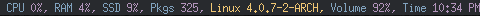

## dwm-bar.c

Statusbar program for dwm that I've written in my very first day as dwm user.

Please note that the program won't detect fans connected via molex connetor(s) or external fan controller. Also I have not tested it with fan splitter(s) either.

The program is smart enough to detect whether some of your fan(s) blades are spinning, or the particular fan have been removed. Hold down some of your fan blades and you'll see that the program won't include this fan and it's RPM, release the blades and you'll see the fan and it's RPM in the statusbar.

## Installation

    bash bootstrap distro
    ./configure --prefix=$HOME/.cache
    make && make install

Replace **distro** with archlinux, debian, gentoo, slackware, rhel, frugalware, angstrom. Note the lowercase naming. Linux Mint, LMDE and Ubuntu are Debian based distributions, so the **get_packs** function will work properly, that's because those distros are using the same base:

- [x] archlinux based distros: parabola, chakra, manjaro
- [x] debian based distros: ubuntu, linux mint, trisquel, back track, kali linux, peppermint linux, solusos, crunchbang, deepin, elementary os, and the rest \*buntu based distros
- [x] gentoo based distros: funtoo, sabayon, calculate linux
- [x] slackware
- [x] rhel based distros: opensuse (uses rpm), fedora, fuduntu, mandriva, mandrake, viperr, mageia
- [x] frugalware
- [x] angstrom

## Requirements

* gcc/clang
* glibc
* autoconf
* automake
* m4
* gawk
* alsa-utils
* alsa-lib
* libx11
* xorg-server
* dwm compiled with [statuscolor](https://github.com/wifiextender/dwm-fork/blob/master/patches/statuscolours.diff) patch. The colors in use are specified in your [config.h](https://github.com/wifiextender/dwm-fork/blob/master/config.h#L6)

## Now what ?

Take a look in my [xinitrc](https://github.com/wifiextender/dotfiles/blob/master/archlinux-openbsd/home/frost/.config/misc/xinitrc) and [dwm-start](https://github.com/wifiextender/dotfiles/blob/master/archlinux-openbsd/home/frost/.config/dwm_scripts/dwm-start).
